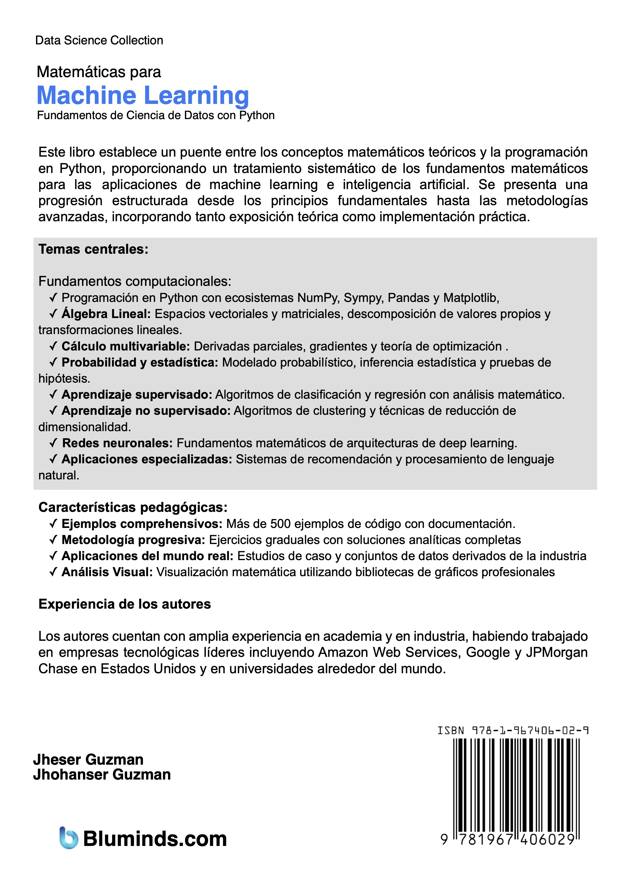
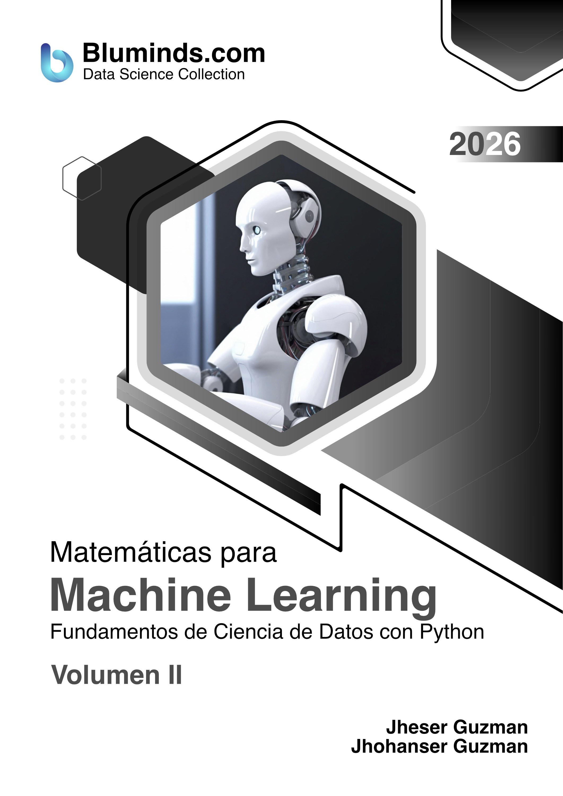

# Matemáticas para Machine Learning — 1ra Edición

**Autores:** Jheser Guzman, Jhohan Guzman

---

| FRONT COVER | REAR COVER |
|:---:|:---:|
|  |  |

---

## Descripción

Este libro establece un puente entre los conceptos matemáticos teóricos y la programación en Python, proporcionando un tratamiento sistemático de los fundamentos matemáticos para las aplicaciones de machine learning e inteligencia artificial. Se presenta una progresión estructurada desde los principios fundamentales hasta las metodologías avanzadas, incorporando tanto exposición teórica como implementación práctica.

---

### Temas centrales

**Fundamentos computacionales:**
- **✓ Programación en Python** con ecosistemas NumPy, Sympy, Pandas y Matplotlib
- **✓ Álgebra Lineal:** Espacios vectoriales y matriciales, descomposición de valores propios y transformaciones lineales
- **✓ Cálculo multivariable:** Derivadas parciales, gradientes y teoría de optimización
- **✓ Probabilidad y estadística:** Modelado probabilístico, inferencia estadística y pruebas de hipótesis
- **✓ Aprendizaje supervisado:** Algoritmos de clasificación y regresión con análisis matemático
- **✓ Aprendizaje no supervisado:** Algoritmos de clustering y técnicas de reducción de dimensionalidad
- **✓ Redes Neuronales:** Fundamentos matemáticos de arquitecturas de deep learning
- **✓ Aplicaciones especializadas:** Sistemas de recomendación y procesamiento de lenguaje natural

---

## Presentaciones del libro

| Formato | Volumen I | Volumen II |
|---------|:---------:|:----------:|
| 📗 **Paperback + Color** |  [🛒 Comprar Vol. I](https://www.amazon.com/dp/1967406006)|  [🛒 Comprar Vol. II](https://www.amazon.com/dp/1967406014) |
| 📘 **Paperback + Escala de Grises** |  [🛒 Comprar Vol. I](https://www.amazon.com/dp/1967406391) |  [🛒 Comprar Vol. II](https://www.amazon.com/dp/1967406405) |
| 📙 **Hardcover + Color Premium** | [🛒 Comprar Vol. I](https://www.amazon.com/dp/1967406049) | [🛒 Comprar Vol. II](https://www.amazon.com/dp/1967406057) |

---

## Tabla de Contenido

| # | Volumen | Capítulo | Notebook |
|:-:|:--------:|--------|:--------:|
| — | Vol I | Antes de Comenzar | [▶](source_code/before_to_begin.ipynb) |
| 1 | Vol I | Introducción a Machine Learning | [▶](source_code/chapter_01.ipynb) |
| 2 | Vol I | Programación con Python para Machine Learning | [▶](source_code/chapter_02.ipynb) |
| 3 | Vol I | Python para Analisis de Datos | [▶](source_code/chapter_03.ipynb) |
| 4 | Vol I | Visualizacion de Datos | [▶](source_code/chapter_04.ipynb) |
| 5 | Vol I | Aritmética, Álgebra, Geometría y Trigonometría | [▶](source_code/chapter_05.ipynb) |
| 6 | Vol II | Álgebra Lineal, Cálculo y Ecuaciones Diferenciales | [▶](source_code/chapter_06.ipynb) |
| 7 | Vol II | Probabilidad y Estadística | [▶](source_code/chapter_07.ipynb) |
| 8 | Vol II | Módulos de Python para Machine Learning | [▶](source_code/chapter_08.ipynb) |
| 9 | Vol II | Algoritmos Supervisados | [▶](source_code/chapter_09.ipynb) |
| 10 | Vol II | Algoritmos No-Supervisados | [▶](source_code/chapter_10.ipynb) |
| A | | Apéndice A | [▶](source_code/ZZ_appendix_a.ipynb) |

> Cada capítulo incluye también un notebook de **problemas resueltos** (`chapter_XX_solved_problems.ipynb`).

📄 **Muestra gratuita:** [Descargar Capítulo 1 (PDF)](ebook_sample/Matematicas%20para%20Machine%20Learning%2C%20Jheser%20Guzman%20y%20Jhohanser%20Guzman%2C%202026%2C%20Ebook%20Sample%20%28Chapter%201%29.pdf)

---

## Contacto e Información

- 🌐 **Sitio web:** [www.bluminds.com](https://www.bluminds.com)
- 🐦 **Twitter / X:** [@blumindsllc](https://x.com/blumindsllc)
- 🎬 **YouTube:** [youtube.com/@bluminds](https://www.youtube.com/@bluminds)
- 💻 **Código Fuente:** [github.com/Bluminds/Book-MMLv1-CodeExamples](https://github.com/Bluminds/Book-MMLv1-CodeExamples/source_code)
- 💻 **Slides:** Contactar a [info@bluminds.com](mailto:info@bluminds.com) (incluye el recibo de compra del libro).
- 📧 **Contacto:** [info@bluminds.com](mailto:info@bluminds.com)

---

## Fe de Erratas

Si encuentras un error en el libro (tipográfico, matemático o de código), puedes reportarlo abriendo un [Issue en GitHub](https://github.com/Bluminds/Book-MMLv1-CodeExamples/issues) o enviando un correo a [info@bluminds.com](mailto:info@bluminds.com) con el asunto **"Fe de Erratas"**, indicando:
- Número de página
- Párrafo o sección donde se encuentra el error
- Descripción de la corrección propuesta

Las correcciones verificadas se registran en la siguiente tabla:

| Página | Párrafo | Corrección |
|--------|---------|------------|
| | | |
